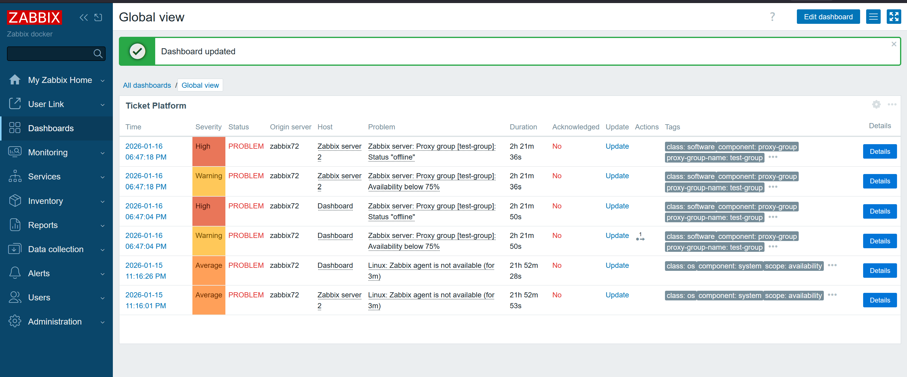
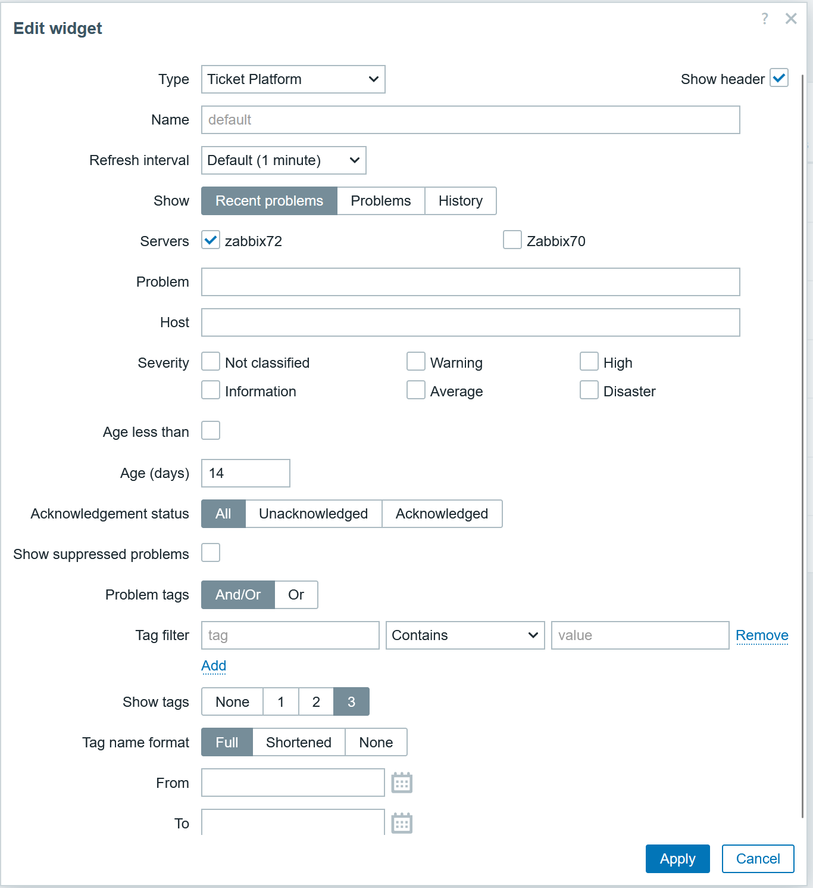

# Ticket Platform Widget

Dashboard widget for the Ticket Platform module. It renders the same problem list columns and styling as the Ticket Platform module view and supports the same filter options inside the widget configuration.

## Requirements
- Zabbix frontend with modules enabled
- Ticket Platform module installed and configured:
  `zabbix-module-external-problems` (https://github.com/manuello1996/zabbix-module-external-problems)

## Features
- Shows Ticket Platform problems summary directly on a dashboard
- Same columns as the module view (time, severity, status, server, host, problem, duration, ack, update, actions, tags)
- Popup actions for acknowledge, trigger details, and remote host details
- Widget filters mirror the module filters (servers, show mode, problem/host, severity, age, ack, suppressed, tags, time period)

## Installation
1) Place this module in your Zabbix modules directory, for example:
   `modules/zabbix-module-ticket-platform-widget`
2) Ensure the Ticket Platform module is installed and configured (servers, tokens, etc.).
3) Reload the Zabbix frontend or clear caches if needed.

## Usage
1) Add the widget to a dashboard.
2) Open "Edit widget" and configure the filters as needed.
3) Apply and save the dashboard.

## Notes
- If no servers are selected, the widget will show a warning.
- If the Ticket Platform module is missing or misconfigured, the widget shows an error in the widget content.

## Repository
Ticket Platform module: https://github.com/manuello1996/zabbix-module-external-problems
